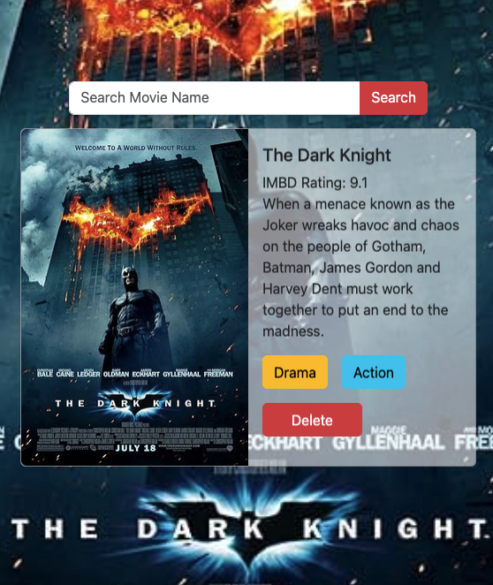

# The world movie webiste

Welcome to the World Movie website!
This project lets you search for your favorite movies and save them to a personal watchlist below —
so next time you visit, your picks are right where you left them.



## Table of Contents

- [Introduction](#introduction)
- [Features](#featuers)
- [Technoloies Used](#technologies-used)
- [How to Use](#how-to-use)
- [Usage](#usage)
- [Project Structure](#project-structure)
- [Contributing](#contributing)
- [License](#license)
- [Contact](#contact)

## Introduction

This project is build with React and deployed via GitHub Pages / Vercel.
Also, this project request movie API from http://www.omdbapi.com

[Visit Live Website](https://movie-world-sooty.vercel.app/)

## Featuers

- **Responsive Design**: Optimized for all devices, including desktops, tablets, and mobile phones.

## Technologies used

- **Frontend**:
  - HTML5
  - CSS3
  - ReactJS
  - Boostrap
  - API
- **Backend**:
- **Database**:
- **Deployment**
  - Vercel

## How to use?

To set up this project in your device locally, please follow the steps:

1.  **Clone the respository**:
    run the following command in your terminal:
    > ```
    >   git clone https://github.com/yadin-nou/movie-world
    > ```
2.  **Navigate to the project directory**:
    > ```
    >   cd yadin-nou
    > ```
3.  **Install Dependencies**:
    > ```
    >   yarn
    > ```
4.  **Run the development server**:
    > ```
    >   yarn dev
    > ```

## Usage

## Project Structure

```
movie-world
|-- public
|-- src
| |-- components
| | |-- Display.jsx
| | |-- Form.jsx
| | |-- MovieList.jsx
| |-- uitls
| | |-- axios.js
| | |-- sesionStorage.js
| | |-- StringRandom.js

```

## Contributing

## License

## Contact

# React + Vite

This template provides a minimal setup to get React working in Vite with HMR and some ESLint rules.

Currently, two official plugins are available:

- [@vitejs/plugin-react](https://github.com/vitejs/vite-plugin-react/blob/main/packages/plugin-react) uses [Oxc](https://oxc.rs)
- [@vitejs/plugin-react-swc](https://github.com/vitejs/vite-plugin-react/blob/main/packages/plugin-react-swc) uses [SWC](https://swc.rs/)

## React Compiler

The React Compiler is not enabled on this template because of its impact on dev & build performances. To add it, see [this documentation](https://react.dev/learn/react-compiler/installation).

## Expanding the ESLint configuration

If you are developing a production application, we recommend using TypeScript with type-aware lint rules enabled. Check out the [TS template](https://github.com/vitejs/vite/tree/main/packages/create-vite/template-react-ts) for information on how to integrate TypeScript and [`typescript-eslint`](https://typescript-eslint.io) in your project.
